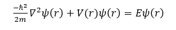
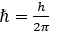
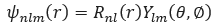
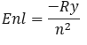

Welcome to the "Quantum Hydrogen Atom" experiment. In this experiment, we delve into the fascinating realm of quantum mechanics by exploring the behavior of electrons within a hydrogen atom. Hydrogen, being the simplest atom with only one proton and one electron, provides an ideal platform for studying fundamental quantum phenomena. Through this experiment, we aim to gain insights into the wave nature of particles, the concept of orbitals, and the probabilistic nature of electron distribution within the atom. 
The behavior of electrons in a hydrogen atom is described by the Schrödinger equation, which governs the wave function of the electron.  
The time-independent Schrödinger equation for the hydrogen atom is given by: 
Where: 
1. ℏ is the reduced Plank constant,  
2. m is the mass of the particle, 
3. E is the total energy of the electron in the atom 
4. Ψ(r) denotes the wavefunction of electron, dependent on the position vector r.  
5. V(r): is the electrostatic potential energy experienced by the electron due to the nucleus 
6. ∇^2 is the Laplacian operator. 
The solution to the Schrödinger equation yields a set of wave functions, denoted by ψ(r) which describe the spatial distribution of the electron's probability density within the atom. These wave functions are organized into orbitals, characterized by three quantum numbers: the principal quantum number n, the azimuthal quantum number l, and the magnetic quantum number ml. 
The wave function Ψ(r) :  
Where:  
1. R_nl (r) is the radial part of the wave function, dependent on the radial distance r from the nucleus. 
2. Y_lm (θ,∅) is the spherical harmonic function, dependent on the polar angles θ , ∅ 
representing the orientation of the orbital in space. 
The radial part Rnl(r) of the wave function is determined by the radial Schrödinger equation, which can be solved using appropriate boundary conditions and numerical methods.Each orbital is associated with a specific energy level, given by the expression:  
where Ry is the Rydberg constant. 
Through this experiment, we aim to visualize these orbitals, understand their properties, and explore the intricate quantum nature of the hydrogen atom.

